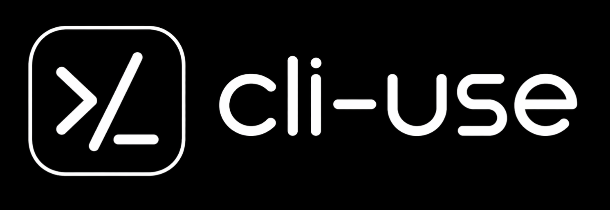

<p align="center">
  
</p>

**Turn any MCP server into a CLI in one command.** Cut the token cost of AI agents by 60–80%, every call, forever.

```bash
git clone https://github.com/cli-use/cli-use.git
cd cli-use
pip install -e .
cli-use add fs /tmp                # install + register + emit SKILL.md
cli-use fs list_directory --path /tmp
```

That's it. The filesystem MCP server is now a native CLI — usable by agents, scripts, humans, and anything that can `subprocess.run`.

> `cli-use` makes MCP usable from any shell — at a fraction of the tokens.

## Why this matters

Every MCP tool call burns tokens on three things an agent shouldn't pay for:

1. **Schema discovery** — a verbose JSON schema per tool, loaded into context every session (~200–500 tok each).
2. **Request framing** — JSON-RPC envelope + full argument JSON for every call.
3. **Response parsing** — the server answers in JSON content blocks even when the useful part is one line of text.

Replace the whole chain with a terse CLI and you get native Unix composition *and* real savings.

### Measured against the real `@modelcontextprotocol/server-filesystem` (14 tools)

| session size | MCP tokens | cli-use tokens | savings |
| ---: | ---: | ---: | ---: |
|   1 call  | 2,118 | 440 | **79%** |
|   5 calls | 2,425 | 565 | **77%** |
|  20 calls | 3,577 | 1,033 | **71%** |
| 100 calls | 9,721 | 3,529 | **64%** |

Fixed discovery cost: **80% cheaper**. Per-call I/O: **59% cheaper**.
Reproduce with `python examples/real_benchmark.py`.

## The 30-second demo

```bash
# 1) Install an MCP server as a cli-use alias
$ cli-use add fs /tmp
cli-use: emitted skill → skills/fs
cli-use: 'fs' installed (14 tools)

# 2) Call any tool like a regular CLI
$ cli-use fs list_directory --path /tmp
notes.md
report.pdf
...

# 3) Compose with the rest of Unix
$ cli-use fs search_files --path /tmp --pattern "*.md" | head
$ cli-use fs read_text_file --path /tmp/notes.md | grep TODO
```

Every `add` also drops a [Vercel-format SKILL.md](https://vercel.com/docs/agent-resources/skills) in `skills/<alias>/` and a pointer in `AGENTS.md`, so any agent working in that repo learns the CLI automatically — zero human prompting required.

## Built-in registry

10 MCP servers are pre-wired — see them with `cli-use list`:

```
  fs          Read, write, list, and search files on disk.
  memory      Knowledge-graph memory: entities, relations, observations.
  gh          Interact with GitHub: issues, PRs, repos.
  git         Git log, diff, status, blame.
  sqlite      Query and inspect SQLite databases.
  time        Current time and timezone conversions.
  fetch       Fetch a URL and return HTML/markdown.
  puppeteer   Headless-browser automation.
  brave       Web search via Brave Search API.
  slack       Send messages, list channels, read history.
```

Install sources: `npm`, `pip`, `pipx`, `local` commands. Add your own in one line:

```bash
cli-use add my-server --from "npm:@acme/my-mcp-server"
cli-use add weather   --from "pip:weather-mcp-server"
cli-use add dev-tools --from "local:python /opt/mcp/server.py"
```

## Two flavors

### Flavor 1 — Convert an existing MCP server (the main path)

```bash
cli-use add fs /tmp              # → cli-use fs <tool>
```

Everything installed, cached, and exposed as `cli-use <alias> <tool> --flag value`.

### Flavor 2 — Write a new agent-friendly CLI from scratch

```python
# hello_cli.py
from cli_use import agent_tool, run_cli

@agent_tool
def greet(name: str, shout: bool = False) -> str:
    "Greet someone by name."
    msg = f"hello {name}"
    return msg.upper() if shout else msg

if __name__ == "__main__":
    run_cli(emit_skill=True, alias="hello")
```

```bash
$ python hello_cli.py greet --name world
hello world
```

`emit_skill=True` drops a `skills/hello/SKILL.md` + AGENTS.md entry alongside the script, so your custom CLI is also self-documenting to agents.

Boolean flags support both forms: `--flag` and `--no-flag`.

## Why it works (the protocol one-liner)

| Protocol | Universal shell client |
| --- | --- |
| HTTP | `curl` |
| Kubernetes API | `kubectl` |
| Docker daemon | `docker` |
| **MCP** | **`cli-use`** |

## Design principles

- **Zero runtime deps.** Pure Python stdlib once installed from the repo.
- **Terse `--help` by design.** An agent learns a 14-tool CLI in ~400 tokens instead of ~2000.
- **Plain-text stdout.** Pipes to `jq`, `grep`, `awk`, `xargs` without ceremony.
- **Persistent aliases.** Install once, every project in your shell inherits it.
- **Skills by default.** Agents pick up the CLI from SKILL.md/AGENTS.md with no hand-holding.
- **Smoke-tested on Linux, macOS, and Windows.**

## Low-level commands (for power users)

```bash
cli-use convert "npx -y @modelcontextprotocol/server-filesystem /tmp" \
    --out ./fs-cli.py --emit-skill --alias fs
cli-use run "python mock_mcp.py" greet --arguments '{"name":"YC"}'
cli-use mcp-list "python mock_mcp.py" --format json
```

## Roadmap

- **v0.2** — daemon mode (keep MCP hot, <10 ms per call), MCP-proxy mode (cli-use as a drop-in MCP server for Claude Desktop/Cursor), multi-modal output passthrough, schema-backed validation, call caching, Langfuse/OTel export.

## Status

Alpha. Python 3.10+. Zero runtime deps.

## License

[MIT](LICENSE) © 2026 cli-use contributors.
